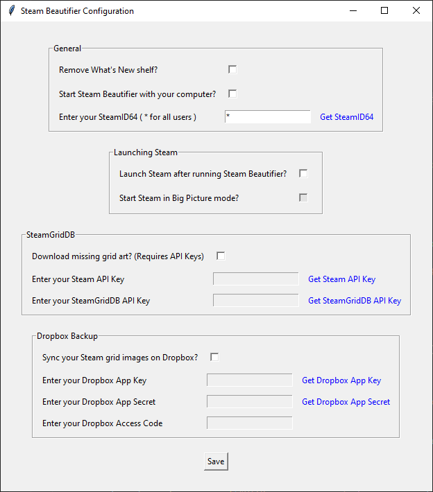

# Steam Beautifier
A utility to enhance the visual aesthetics of games within the Steam library.

## Table of Contents
- [Description](#description)
- [Installation](#installation)
- [Usage](#usage)
- [Features](#features)
- [Screenshots](#screenshots)

## Description
Steam Beautifier is designed for users who want a cleaner, more visually appealing Steam library experience. It focuses on optimizing the look of your library and personalizing your game art across devices. With Steam Beautifier, you can:

Declutter Your Library: Automatically remove the "What's New" section from your Steam Library, keeping the focus on your game collection without unnecessary distractions.

Complete Your Cover Art: Download high-quality vertical cover art (600x900) for games that lack it, ensuring every title in your library has a consistent, polished look.

Sync Custom Artwork Across Devices: If you set custom cover art for a game, Steam Beautifier will sync it across all devices running the utility, so your personalized artwork is seamlessly applied wherever you play.

Whether you’re looking for a streamlined library or cohesive cover art across your collection, Steam Beautifier makes managing and beautifying your Steam Library effortless.

## Installation
You can install and run Steam Beautifier in several ways, depending on your operating system and preference:

### Windows

1. **Using the Windows Installer**:
   - Download the latest Windows installer `.exe` file from the [Releases](#) section.
   - Run the installer and follow the on-screen instructions.
   - Once installed, launch *Steam Beautifier* from the Start menu.

2. **Using the Standalone Windows Executable**:
   - Download the standalone `.exe` file from the [Releases](#) section.
   - Place the file in a desired directory and double-click to run. No installation required!

### Python (Cross-platform)

If you prefer to run *Steam Beautifier* directly as a Python app, make sure you have Python installed (version 3.10 or higher recommended). Then, follow these steps:

1. **Clone or download the repository**:
   ```bash
   git clone https://github.com/cheex0r/SteamBeautifier.git
   cd  SteamBeautifier
   ```

2.  **Install dependencies**:
    ```bash
    pip install -r requirements.txt
    ```

3.  **Run the application**:
    ```bash
    python src/main.py
    ```

### Building on Windows

If you want to build the executable yourself, follow these steps:

1.  **Prerequisites**:
    - Python 3.10+
    - [Inno Setup](https://jrsoftware.org/isdl.php) (for creating the installer)

2.  **Setup Environment**:
    ```powershell
    # Create and activate virtual environment
    python -m venv venv
    .\venv\Scripts\activate

    # Install dependencies
    pip install -r requirements.txt
    pip install pyinstaller
    ```

3.  **Build Executable**:
    From the project root directory:
    ```powershell
    pyinstaller --noconfirm --onefile --windowed --name "steam_beautifier" --add-data "config_schema.json;."  "src/main.py"
    ```

4.  **Create Installer**:
    - Open `packaging/windows/steam_beautifier.iss` with Inno Setup Compiler.
    - Compile the script.
    - The installer will be generated in `packaging/windows/Output`.

## Usage

Upon first launch, *Steam Beautifier* will guide you through a configuration process using a simple GUI. This setup allows you to customize how the utility operates and what features you’d like to enable.

### Initial Configuration

1. **General Settings**:
   - **Remove "What's New" section**: Choose whether to hide the "What's New" section in your Steam Library for a cleaner look.
   - **Start Steam Beautifier with PC**: Enable this option if you'd like *Steam Beautifier* to start automatically with your PC.
   - **SteamID64**: Enter your SteamID64. (Use `*` if you want the configuration to apply to all users on this device.)
   - **Launch Steam after running Steam Beautifier**: Decide if Steam should launch automatically after *Steam Beautifier* finishes its tasks.
   - **Launch Steam in Big Picture Mode**: If launching Steam automatically, you can choose to start it in Big Picture mode.

2. **Automatic Download Missing Cover Art Settings**:
   - **Download missing grid art**: Enable this if you'd like *Steam Beautifier* to download missing cover (grid) art for games without default vertical images (600x900).
   - **Steam API Key**: Required for downloading cover art. You can obtain your API key from the [Steam API Key page](https://steamcommunity.com/dev/apikey).
   - **SteamGridDB API Key**: If you’d like additional art sources, provide your SteamGridDB API key. Obtain it from [SteamGridDB](https://www.steamgriddb.com/) (sign-up may be required).

3. **Sync Custom Artwork Across Devices** (requires Dropbox):
   - **Sync images across devices**: If you'd like your custom cover art to be synced across devices, enable this option.
   - **Dropbox App Key**: Required for syncing artwork. Create a Dropbox app to obtain this key (see instructions below).
   - **Dropbox App Secret**: Also needed for syncing. Retrieved when creating the Dropbox app.
   - **Dropbox Access Code**: Generate this code to allow *Steam Beautifier* to access your Dropbox for syncing.

   *Instructions for Dropbox setup*: You’ll need to set up a Dropbox app to allow *Steam Beautifier* to access your account for syncing. Follow the [Dropbox Developer Setup Guide](https://www.dropbox.com/developers/apps) to create an app and obtain your **App Key**, **App Secret**, and **Access Code**.

After completing this initial configuration, *Steam Beautifier* will save your settings and run automatically whenever it’s launched, applying your customizations and syncing any selected features.

## Features

*Steam Beautifier* offers a range of features to enhance the appearance and functionality of your Steam library:

1. **Remove "What's New" Section from Library**  
   Automatically removes the "What's New" section from your Steam Library, providing a cleaner and more focused view of your game collection.

2. **Automatic Cover Art Downloads**  
   Downloads high-quality cover art (600x900) for games without default vertical images, giving your library a polished, consistent look. Supports both Steam's API and SteamGridDB for a broader range of cover art options.

3. **Cross-Device Artwork Syncing**  
   Syncs custom cover art across all your devices running *Steam Beautifier*. Configure Dropbox integration to ensure any custom artwork you set on one device is automatically updated on others.

With these features, *Steam Beautifier* helps you create a visually appealing, organized Steam library that reflects your personal style and preferences across devices.

## Screenshots

### "What's New" Removed


### GUI Setup

